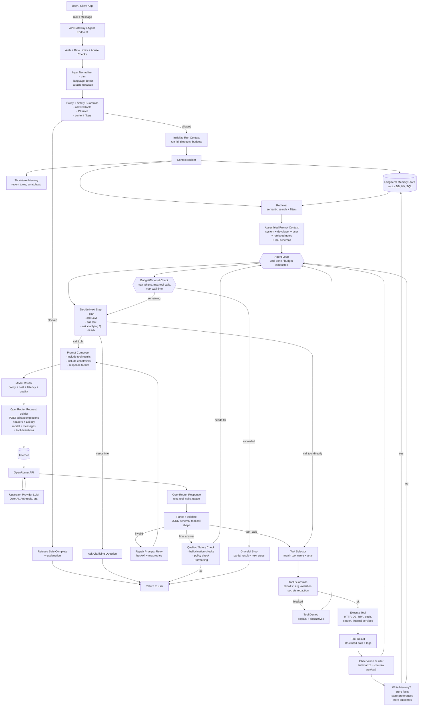

```mermaid
flowchart TD
  U[User / Client App] -->|Task / Message| GW[API Gateway / Agent Endpoint]
  GW --> AUTH[Auth + Rate Limits + Abuse Checks]
  AUTH --> IN[Input Normalizer<br/>- trim<br/>- language detect<br/>- attach metadata]
  IN --> POL[Policy + Safety Guardrails<br/>- allowed tools<br/>- PII rules<br/>- content filters]
  POL -->|blocked| BLK[Refuse / Safe Complete<br/>+ explanation] --> OUT[Return to user]
  POL -->|allowed| S0[Initialize Run Context<br/>run_id, timeouts, budgets]

  S0 --> MEM[Context Builder]
  MEM --> STM[Short-term Memory<br/>recent turns, scratchpad]
  MEM --> LTM[(Long-term Memory Store<br/>vector DB, KV, SQL)]
  MEM --> RETR[Retrieval<br/>semantic search + filters]
  LTM --> RETR
  RETR --> CTX[Assembled Prompt Context<br/>system + developer + user<br/>+ retrieved notes<br/>+ tool schemas]

  CTX --> LOOP{{Agent Loop<br/>until done / budget exhausted}}
  LOOP --> DEC[Decide Next Step<br/>- plan<br/>- call LLM<br/>- call tool<br/>- ask clarifying Q<br/>- finish]

  DEC -->|needs info| CLQ[Ask Clarifying Question]
  CLQ --> OUT

  DEC -->|call LLM| PMPT[Prompt Composer<br/>- include tool results<br/>- include constraints<br/>- response format]
  PMPT --> ROUTE[Model Router<br/>policy + cost + latency + quality]
  ROUTE --> ORQ[OpenRouter Request Builder<br/>POST /chat/completions<br/>headers + api key<br/>model + messages<br/>+ tool definitions]
  ORQ --> NET[(Internet)]
  NET --> OR[OpenRouter API]
  OR --> PRV[Upstream Provider LLM<br/>OpenAI, Anthropic, etc.]
  PRV --> OR
  OR --> ORR[OpenRouter Response<br/>text, tool_calls, usage]
  ORR --> PARSE[Parse + Validate<br/>JSON schema, tool call shape]
  PARSE -->|invalid| REPAIR[Repair Prompt / Retry<br/>backoff + max retries] --> PMPT

  PARSE -->|tool_calls| TSEL[Tool Selector<br/>match tool name + args]
  DEC -->|call tool directly| TSEL
  TSEL --> TSAFE[Tool Guardrails<br/>allowlist, arg validation,<br/>secrets redaction]
  TSAFE -->|blocked| TBLK[Tool Denied<br/>explain + alternatives] --> LOOP
  TSAFE -->|ok| TEXE[Execute Tool<br/>HTTP, DB, RPA, code,<br/>search, internal services]
  TEXE --> TORES[Tool Result<br/>structured data + logs]
  TORES --> OBS[Observation Builder<br/>summarize + cite raw payload]
  OBS --> MEMW[Write Memory?<br/>- store facts<br/>- store preferences<br/>- store outcomes]
  MEMW -->|yes| LTM
  MEMW -->|no| LOOP
  OBS --> LOOP

  PARSE -->|final answer| QA[Quality / Safety Check<br/>- hallucination checks<br/>- policy check<br/>- formatting]
  QA -->|needs fix| LOOP
  QA -->|ok| OUT

  LOOP --> BUD{{Budget/Timeout Check<br/>max tokens, max tool calls,<br/>max wall time}}
  BUD -->|exceeded| GRACE[Graceful Stop<br/>partial result + next steps] --> OUT
  BUD -->|remaining| DEC

```